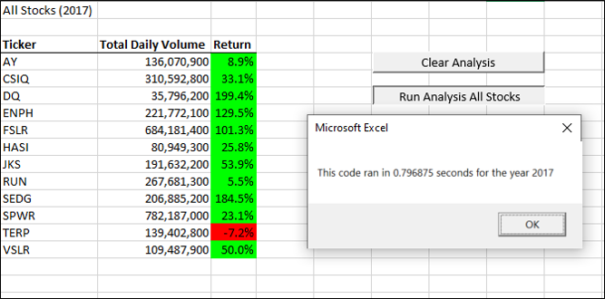
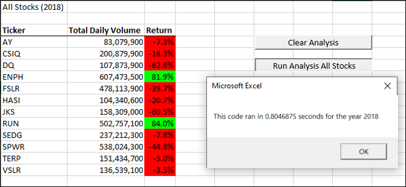

# Stock-Analysis
## Overview of Analysis
The intent of this analysis was to evaluate performance of multiple stocks from different years years in an automated and repeatable fashion. While we could easily use excel to conduct this analysis, the benefit of using VBA allows for reduce potential in human error and reduces the memory and space of the file. By creating this code, we're able to easily review performance from different years, and could reuse this code at a different time to do the same analysis.

## Results
The analysis was focused on refactoring code to run more efficiently. Using the code i created, the code for 2017 ran in .7968 seconds. See a snapshot for 2017 below:

Alternatively, the code for 2018 ran in .8046 seconds. See a snapshots before for 2018:

## Summary
### Advantages and Disadvantages - General
The most obvious advantage of refactoring is that it leads to better quality code. If you were to have a large audiance of users for your application, you would want as clean of code as possible. One of the disadvantages is that you might have to retest or restate lots of basic functionality. This is important to leave descriptions and directions in your code for people to understand it. (site: Stack overflow - 'https://stackoverflow.com/questions/43983284/what-are-the-advantages-and-disadvantages-of-refactoring-code-smell-in-software)

### Advantages and Disadvantages - VBA
The advantage for refactoring the original code is that it ran faster compared to the original line of code for my desktop. Disadvantage of vba overall is having to be very specific in syntax compared to other languages to set variables etc. Python's language is a little more forgiving with not having to be so explicit on syntax.

